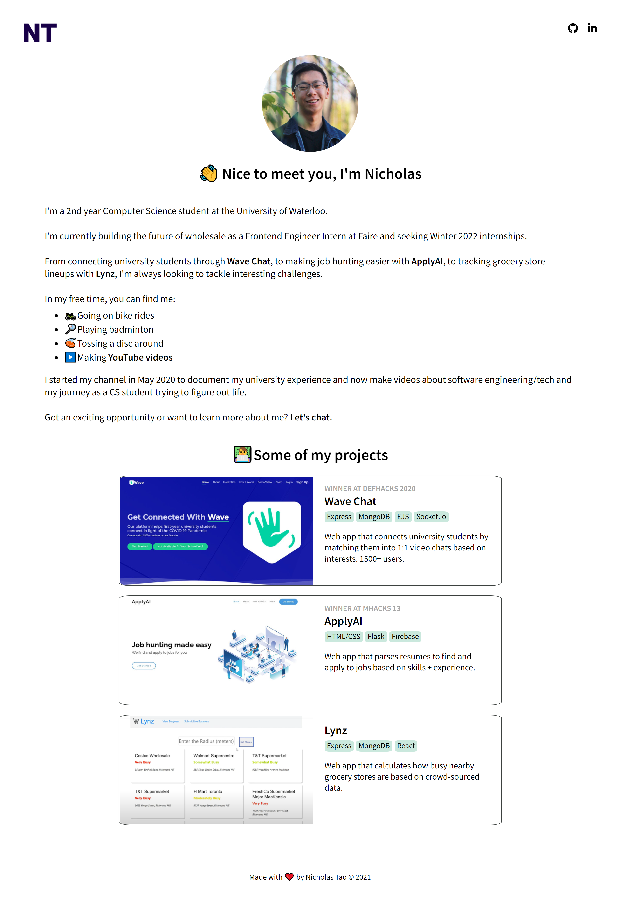

# Personal Website V2- 2021 Edition

My [old website](https://github.com/nicholas-tao/nicholas-tao.github.io) was built 2 years ago from a template using HTML+CSS+JS, so I'm building a new one (WIP)!

V2 is much more minimalistic and built with React+Typescript. Hosted on [Netlify](https://www.netlify.com/).

Check it out: [nicholas.tao.com](https://nicholastao.com)

